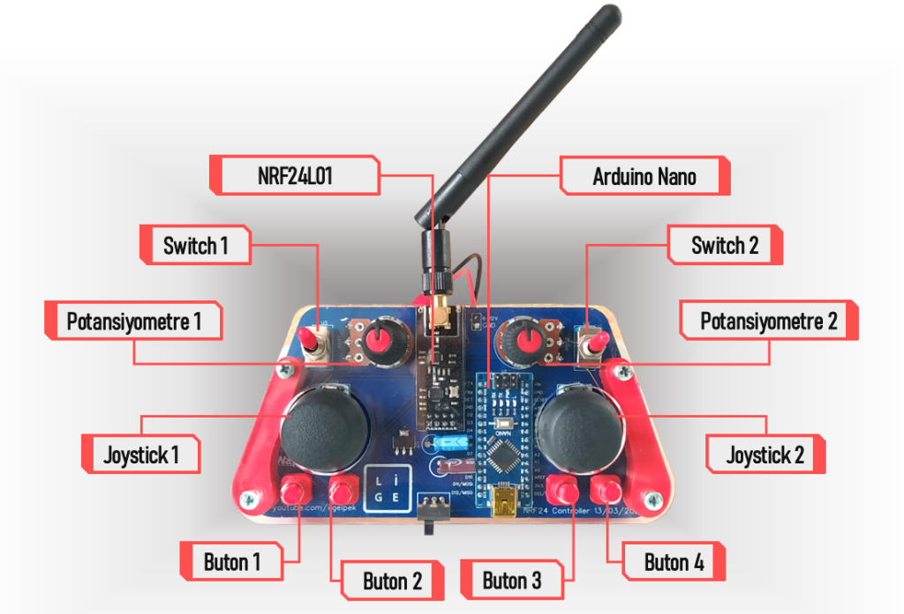
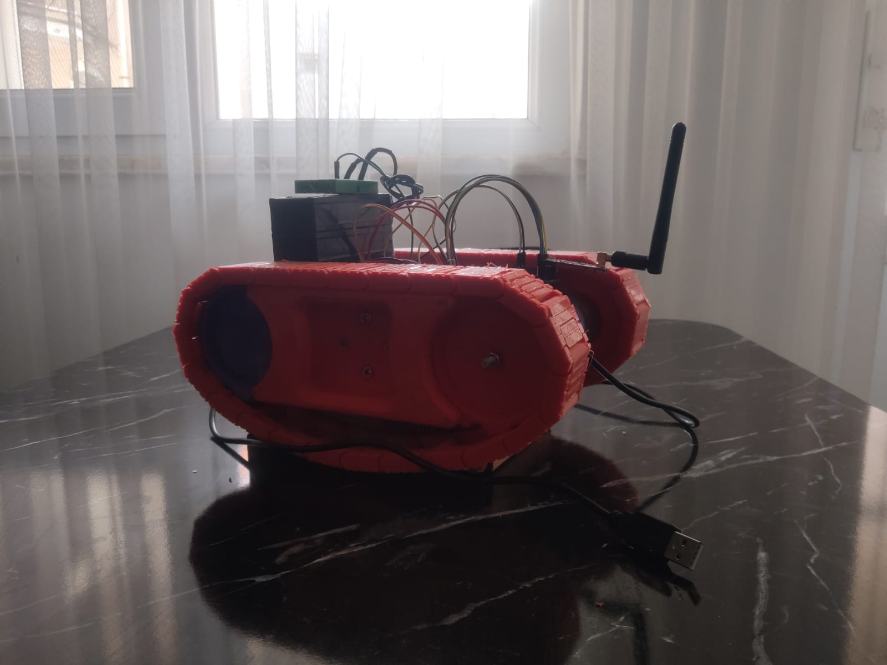

# 🚀 NRF24L01 ile Kablosuz Kontrol Edilen Rover

## 📌 Proje Hakkında
Bu proje, **NRF24L01 ile kablosuz olarak kontrol edilen sıfırdan tasarlanmış bir rover (kara aracı)** geliştirmeyi amaçlamaktadır. Kumanda tarafında **joystick, butonlar, potansiyometreler ve switchler** kullanılarak aracın hareketi sağlanmaktadır. **L298N motor sürücü kartı** ile motor kontrolü yapılmaktadır.

## 📷 Kumanda ve Diyagram
Aşağıda kumanda kartının şematik görüntüsü verilmiştir:



---

## 📂 Dosya Yapısı
Bu projede aşağıdaki dosyalar bulunmaktadır:

- **`Rover.ino`** → Rover (araç) için ana kontrol kodları
- **`RoverJoystick.ino`** → Kumanda tarafındaki joystick kontrol kodları
- **`L298ND.cpp & L298ND.h`** → Motor sürücü kodları (L298N ile hız ve yön kontrolü)
- **`PortRF24.cpp & PortRF24.h`** → NRF24L01 ile kablosuz haberleşme kodları

---

## 🔧 Kullanılan Bileşenler ve Modüller
Bu proje aşağıdaki elektronik bileşenleri kullanmaktadır:

### 🎮 Kumanda Tarafı
- **Arduino Nano** → Kumanda işlemlerini yönetir
- **NRF24L01** → Kablosuz haberleşme sağlar
- **Joystick x2** → Araç yönlendirme ve kamera hareketi
- **Potansiyometre x2** → Hız kontrolü
- **Buton x4 & Switch x2** → Ekstra kontrol butonları

### 🚗 Araç Tarafı (Rover)
- **Arduino Nano** → Aracı kontrol eder
- **NRF24L01** → Kumandadan gelen verileri alır
- **L298N Motor Sürücü** → Motorları kontrol eder
- **DC Motorlar x2** → Araç hareketi sağlar
- **Servo Motor** → Kameranın açısını değiştirmek için

---

## ⚙️ Kurulum & Çalıştırma

### 1. Gerekli Kütüphaneleri Yükleyin
Aşağıdaki kütüphaneleri yükleyerek projeyi çalıştırabilirsiniz:
```bash
pip install pyserial
```
Arduino tarafında ise aşağıdaki kütüphanelerin yüklenmesi gerekir:
- **RF24** (NRF24L01 için)
- **Servo** (Servo motor kontrolü için)

### 2. Kodları Arduino'ya Yükleyin
#### Kumanda (Joystick) için:
1. `RoverJoystick.ino` dosyasını açın.
2. Arduino Nano'yu bilgisayara bağlayın.
3. Kodu yükleyin.

#### Araç (Rover) için:
1. `Rover.ino` dosyasını açın.
2. Araçtaki Arduino Nano'yu bağlayın.
3. Kodu yükleyin.

### 3. Kullanım
- Kumanda üzerindeki **joystickler** ile yönlendirme yapılır.
- **Potansiyometreler** ile hız ayarı yapılır.
- **Butonlar ve switchler** ekstra fonksiyonlar için kullanılabilir.

---

## 📊 Fonksiyon Açıklamaları
Bu projede kullanılan temel fonksiyonlar:

### **Motor Kontrol Fonksiyonları (L298N)**
```cpp
void toForward(uint8_t velocity);  // İleri git
void toBackward(uint8_t velocity); // Geri git
void toRight(uint8_t velocity);    // Sağa dön
void toLeft(uint8_t velocity);     // Sola dön
void toStop();                     // Dur
```

### **Kablosuz Haberleşme Fonksiyonları (NRF24L01)**
```cpp
void initialization();  // Haberleşmeyi başlat
void resetData();       // Veriyi sıfırla
void displayResults();  // Gelen verileri göster
```

---

## 📝 Katkıda Bulunma & Lisans
Bu proje **kişisel geliştirme amaçlıdır** ve herkesin kullanımı için açıktır. Geliştirmeye katkıda bulunmak isterseniz **pull request** gönderebilir veya issue açabilirsiniz!

🚀 **Hazırlayan:** NamKodX
